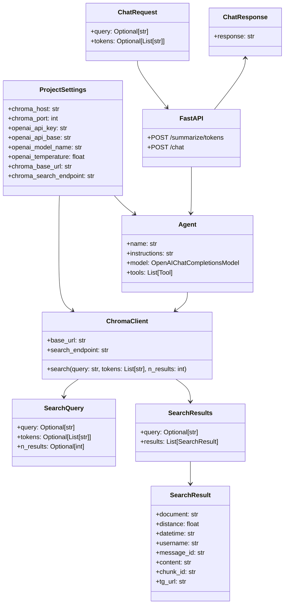

# Web3 Assistant Chat Service

A chatbot service that leverages LLM capabilities to provide intelligent responses about web3/crypto topics using a vector database backend.

## Components

## API Endpoints
Swagger UI: http://localhost:4400/docs

### POST `/chat`
Token-based chat interaction endpoint.

**Request Body:**
```json
{
    "tokens": ["token1", "token2"]
}
```

**Response:**
```json
{
    "response": "Detailed analysis and recommendations based on tokens"
}
```

## Usage

### Starting the Service

1. Set up environment variables using `.env` file
2. Make sure `web3-assistant-network` Docker network is created
3. Launch app: `docker-compose up`

### Available CLI
Test agent with query: `python -m src.agent -q "Are there any trading courses?"`. Run from inside the container.

## Code Diagram

